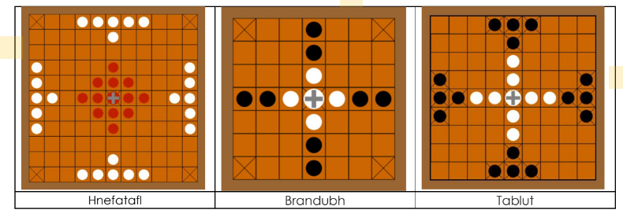
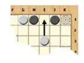
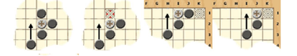

# Design Pattern Tabuleiro Hnefatafl

Project for the Design Patterns Course

This code (Java) consists of the implementation of the **Hnefatafl** board game, using design patterns. The game allows two people to play against each other on the same computer. Along with the code, there is a PDF article identifying the use of the design pattern.

The game should allow the selection between three types of boards, as shown in the image below:

**Game Rules:**

* The Defenders correspond to the central group, with the King represented by the cross. The group at the edges corresponds to the Mercenaries.
* The game starts with the Defenders. Players alternate turns, moving one piece per turn.
* Any piece (even the King) can move any number of squares horizontally or vertically (but not diagonally), similar to the rook in chess, but never jumping over other pieces.
* It is also possible, depending on the combination of the players, to move pieces only 1 square at a time (this should be an option when initializing the game).
* It is also possible, depending on the combination of the players, for the King to move 1 or 4 squares.
* Only the King can occupy the central square (throne) and one of the four corner squares (refuges).
* After moving the King, if there is a free path to one of the refuges, the player must say “Raichi!” to alert the opponent.
* Mercenaries win if they manage to capture the Swedish King.
* Defenders win if they manage to guide their King to one of the corners (refuge).
* If, after moving the King, there are free paths to two refuges, the player must say “Tuichi!” and the game ends.
* Pieces from both sides can be captured.
* A piece is captured when it is surrounded by two opposing pieces, forming a sandwich with the opponent's piece.
* A piece can also be captured if it is trapped between an enemy and the throne, or an enemy and a refuge.
* Multiple pieces can be captured simultaneously. In the example below, two black pieces are captured.

* The King can participate in a capture just like its soldiers.
* A piece can intervene between two enemy pieces in a move. In this case, it is not captured.
* There are four ways to capture the King.

* If the King is in danger of being captured, the Mercenaries must say "Olha o Rei" ("Look at the King").

